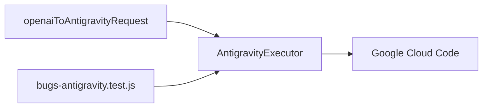

# Antigravity

## Responsabilidade

Formatar e enviar requisições Gemini Cloud Code para o upstream Antigravity, preservando chamadas de ferramenta e removendo partes de pensamento que não podem ser reenviadas.

## Entidades

- [Antigravity executor](./EXECUTOR.md): transformação final, autenticação e envio da requisição.

## Relações

## Fluxo

O tradutor cria `request.contents` com partes de texto, pensamento e chamadas de ferramenta. O executor remove partes de pensamento, adiciona `thoughtSignature` ausente em chamadas de ferramenta e descarta blocos que ficaram sem partes antes do envio.

## Fontes no código

- `open-sse/translator/request/openai-to-gemini.js`
- `open-sse/executors/antigravity.js`
- `tests/translator/bugs-antigravity.test.js`
