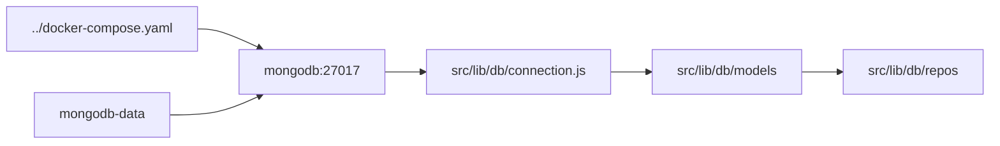

# MongoDB

## Responsabilidade

Documentar a persistência MongoDB usada pela branch `mongodb` e sua execução local no Docker Compose.

## Entidades

- Banco `9router` com coleções de configurações, conexões, nós, combinações, sessões, uso e detalhes de requisições.
- Serviço Compose `mongodb` usando MongoDB 7 e o bind mount raiz `./mongodb-data`.

## Relações

## Fluxo

O compose inicia o Mongo com healthcheck e só então inicia o 9Router. A aplicação usa `MONGODB_URI=mongodb://mongodb:27017/9router`; a porta `29017` é apenas a publicação para acesso local. O dump de desenvolvimento fica em `../data/mongodb-dump/` e pode ser restaurado no diretório persistente antes da promoção.

## Fontes no codigo

- `../docker-compose.yaml`
- `src/lib/db/connection.js`
- `src/lib/db/models/`
- `src/lib/db/repos/`
- `../data/mongodb-dump/`
