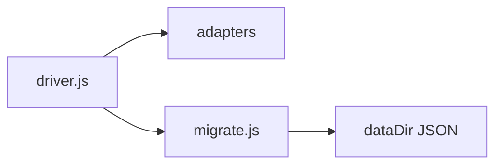

# Banco de dados

## Responsabilidade

Documentar a inicialização SQLite e a recuperação segura de dados persistidos.

## Entidades

- [SQLite](./SQLITE.md): seleção de driver, migrações e recuperação de arquivo corrompido.
- [MongoDB](./MONGODB.md): persistência da branch MongoDB e execução local via Compose.

## Relações

## Fluxo

O processo tenta `better-sqlite3`, `node:sqlite` e `sql.js` no runtime Node. Se o arquivo SQLite estiver estruturalmente inconsistente e houver dados legados, o arquivo é preservado em `db/backups/` e a migração JSON é refeita.

Na branch MongoDB, a persistência de domínio usa Mongoose e o serviço `mongodb` definido no compose da raiz; o diretório local do Mongo fica fora de `./data` para evitar o `chown` recursivo do entrypoint da aplicação.

## Fontes no codigo

- `src/lib/db/driver.js`
- `src/lib/db/paths.js`
- `src/lib/db/migrate.js`
- `src/lib/db/adapters/`
